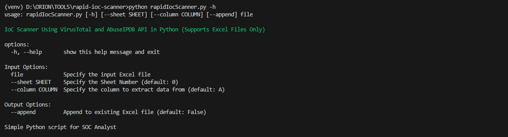
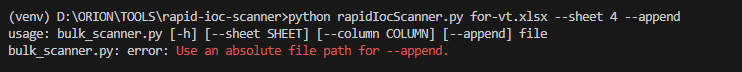
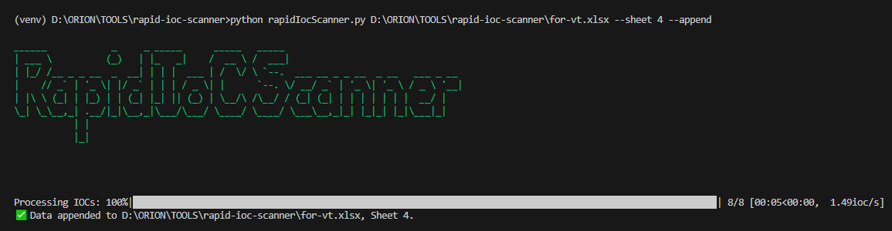
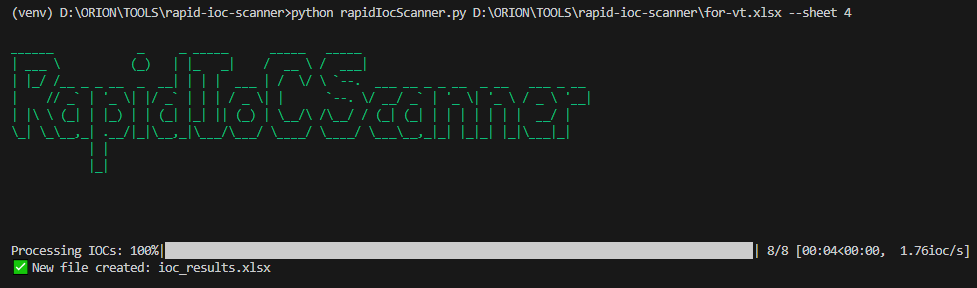

### 📌 Description
This script scans Indicators of Compromise (IoCs) such as IPs, domains, and file hashes using **VirusTotal** and **AbuseIPDb** APIs. The input is an **Excel file**, and results are saved back in an **Excel sheet**.

### 🚀 Features
- Supports **bulk scanning** of IoCs from an Excel file.
- Retrieves risk scores from **VirusTotal** and **AbuseIPDb**.
- Appends results to the existing Excel file or creates a new one.

### Installation
```bash
git clone git@github.com:Romeo-Jr/bulk-scanner.git

virtualenv venv # create virtual environment

venv\scripts\activate # for windows
source venv/bin/activate # for linux

pip install -r requirements.txt # install the dependencies

python bulk_scanner.py -h # for help
```

### 📷 Screenshots



